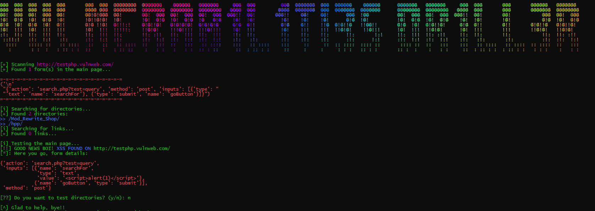

# Vulnerabilities Dr1ll3r

_Note: this image is related to the older version of the tool...read all the README.md to fully understand the future of this tool_

## Installation
For installation you'll need these modules:

- Requests

- Time

- Argparse

- bs4

- Random

- Urllib

- pprint

- colorama

- asciistuff

- user_agent

Yes, quite a lot of modules but...I DON'T CARE Xd

## Options
There are 5 options:
1. **"-c"** or **"--custom"**, use this option if you want to use a custom xss payload for the scan.
2. **"-wl"** or **"--wordlist"**, use this option if you want to use a wordlist of xss payloads.
3. **"-u"** or **"--site"**, you have to define this variable since is the actual target that the tool will scan.
4. **"-m"** or **"--mode"**, you have to define also this variable because is the scanner mode (**"-m xss"** for xss scanner and **"-m lfi"** for lfi scanner)
5. **"-ws"** or **"--swordlist"**, DON'T USE THIS OPTION, is still in development, is still in the code because I'm too lazy for delete this and all related things.

## What I'm going to add...
- [ ] Input-Checking XSS Scanner

- [ ] SQLi Scanner & Exploiter

- [ ] XSS to LFI

- [ ] XSS to RevShell with in-program shell

- [x] LFI to RCE

- [ ] In-program shell for rce

- [x] Improve lfi algorithm

- [x] Improve link parsing in xss mode

- [x] Open Redirect Scanner

(These updates will take a loooot of time...) <I will put the entire code when the whole project its done :)>

~Rennaarenata

~T0rt3ll1n0

**Warning: this tool was made for legal purposes only, we are not responsible if, through this tool, you cause damage to your other devices.**
